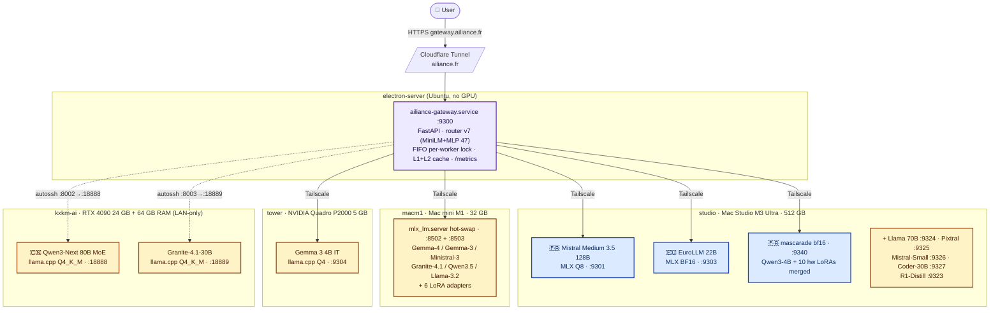
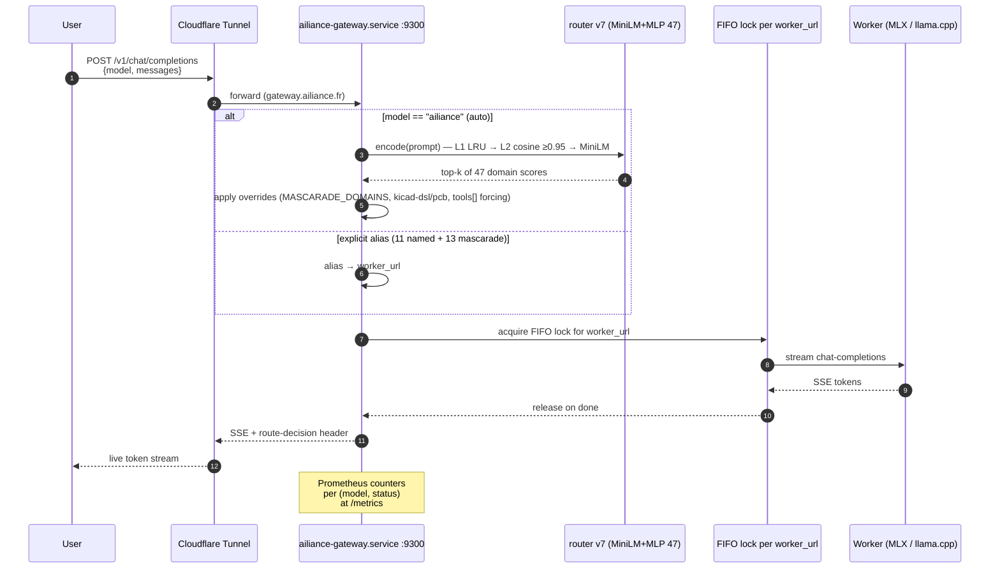
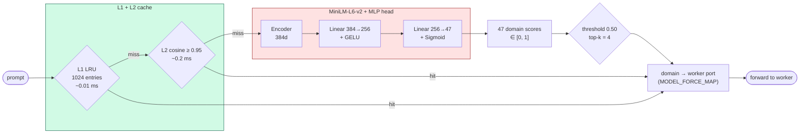
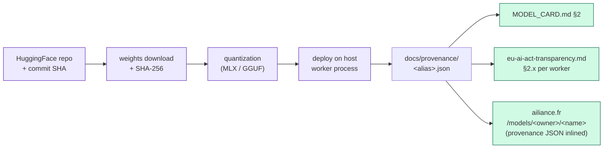
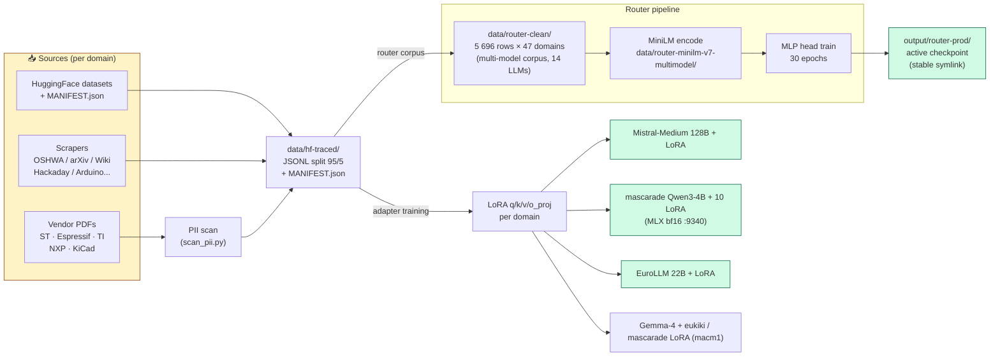

<div align="center">

# ailiance

### EU-sovereign AI infrastructure gateway — 11 backends + 13 hardware-specialist LoRA experts, full provenance, no cloud

[](https://gateway.ailiance.fr/v1/models)
[](LICENSE)
[](docs/eu-ai-act-transparency.md)
[](docs/transparency/router-training-data.md)
[](https://ailiance.fr)

**Public API → [`https://gateway.ailiance.fr`](https://gateway.ailiance.fr/v1/models)** (OpenAI-compatible, no auth) · Landing page [`ailiance.fr`](https://ailiance.fr) · Transparency dossier [`/transparency`](https://ailiance.fr/transparency)

</div>

---

## Where to find related artifacts

- **Public API**: https://gateway.ailiance.fr/v1/* (OpenAI-compatible, no auth — live since 2026-05-12 11:47)
- **Landing page**: https://ailiance.fr (domain verified 2026-05-11)
- **Status dashboard**: https://home.saillant.cc
- **HuggingFace IP source-of-truth**: https://huggingface.co/electron-rare
- **HuggingFace product distribution**: https://huggingface.co/Ailiance-fr (10 models + 13 datasets, 20/20 models Apache-2.0)
- **GitHub org**: https://github.com/ailiance (carve-out from `L-electron-Rare`, 2026-05-11)
- **Audit-grade bench validators**: https://github.com/ailiance/iact-bench (vendored at `vendored/iact-bench`, v0.2.0)
- **Benchmark results**: https://github.com/ailiance/ailiance-bench

Ailiance is the EU-sovereign LLM serving stack of [L'Electron Rare](https://www.electron-rare.fr), a French SME. Multi-model, audit-grade, EU AI Act Art. 13/15/52/53 transparency. The brand was carved out of `L-electron-Rare` on **2026-05-11** into the dedicated [`ailiance` GitHub org](https://github.com/ailiance); domain `ailiance.fr` was verified the same day.

## What it is

A **multi-model LLM serving pipeline** running on a home cluster — **11 named backends** plus **13 mascarade hardware-specialist LoRA experts** behind a single OpenAI-compatible endpoint. The 47-domain MiniLM router decides which backend answers, the FastAPI gateway forwards through a FIFO per-worker lock, the worker streams. No cloud, no telemetry, full audit trail.

### Architecture at a glance



Blue = EU/CH-origin sovereign workers · Amber = third-country base-model workers (annotated in transparency dossier).

### Request lifecycle



## Try it in 10 seconds

```bash
# Pick any worker — same OpenAI shape, no auth
curl -sN https://gateway.ailiance.fr/v1/chat/completions \
  -H 'Content-Type: application/json' \
  -d '{"model":"ailiance-qwen",
       "messages":[{"role":"user","content":"Compare LoRA and QLoRA in two sentences."}]}'

# Or let the router pick (alias "ailiance" = auto):
curl -sN https://gateway.ailiance.fr/v1/chat/completions \
  -H 'Content-Type: application/json' \
  -d '{"model":"ailiance",
       "messages":[{"role":"user","content":"Show me a Rust function that parses TOML"}]}'

# List all 46 aliases:
curl -s https://gateway.ailiance.fr/v1/models | jq '.data[].id'
```

The route decision is surfaced in the SSE stream so you see *why* a worker was picked.

## Why ailiance exists

> Most "open" inference stacks are SaaS-shaped: black-box routing, undisclosed training data, telemetry by default, vendor lock-in dressed up as a free tier. ailiance is the opposite.

| | ailiance | Typical hosted API |
|---|---|---|
| **Where data goes** | Your LAN / Tailscale, period | Cloud egress to vendor |
| **Where weights came from** | HF commit SHA + SHA-256 per file | "Latest" rolling tag |
| **Why this model answered** | Surfaced in the SSE stream | Opaque |
| **Training data trail** | HF dataset id + SPDX license + row count per domain | "Public web" (or worse) |
| **Telemetry** | None | Default-on |
| **Risk classification** | EU AI Act Art. 52 (limited risk), documented | Usually unstated |
| **License of every served weight** | Apache‑2.0 / Gemma TOS, called out per worker | Mixed, usually unstated |

If you ship a product that needs to *prove* what model was used, on what data, under which license, ailiance gives you the receipts. If you're researching sovereign-AI patterns, the cluster + dossier are an honest reference.

## Production fleet

Live at [`gateway.ailiance.fr/v1/models`](https://gateway.ailiance.fr/v1/models) — 46 aliases enumerated.

### 11 named backends

| Alias | Model | Origin | Quant | Host:Port |
|---|---|---|---|---|
| `ailiance` | Auto-router (default — picks per router v7 + overrides) | — | — | — |
| `ailiance-mistral-medium` | **Mistral Medium 3.5 128B Instruct** | Mistral AI 🇫🇷 | MLX Q8 | studio :9301 |
| `ailiance-mistral` | **Mistral Small 3.1 24B Instruct** | Mistral AI 🇫🇷 | MLX 4-bit | studio :9326 |
| `ailiance-gemma` | **Gemma 3 4B IT** | Google DeepMind | llama.cpp Q4_K_M | tower :9304 |
| `ailiance-gemma2` | **Gemma 3 4B IT** (MLX) | Google DeepMind | MLX 4-bit | macm1 :8502 |
| `ailiance-gemma4` | **Gemma-4 E4B + LoRA `gemma4-e4b-eukiki`** | Google DeepMind + L'Electron Rare | MLX 4-bit | macm1 :8502 |
| `ailiance-eurollm` | **EuroLLM 22B Instruct 2512** | utter-project 🇪🇺 | MLX BF16 | studio :9303 |
| `ailiance-qwen` | **Qwen3.5 9B MLX** | Qwen / Alibaba Cloud | MLX 4-bit | macm1 :8502 |
| `ailiance-granite` | **Granite-4.1 30B** | IBM | MLX 4-bit | macm1 :8502 |
| `ailiance-ministral` | **Ministral-3 14B Instruct 2512** | Mistral AI 🇫🇷 | MLX 4-bit | macm1 :8502 |
| `ailiance-ministral-reasoning` | **Ministral-3 14B Reasoning 2512** | Mistral AI 🇫🇷 | MLX 4-bit | macm1 :8502 |

### 13 mascarade hardware-specialist LoRA experts

Served from **MacStudio MLX bf16 `:9340`** since the **2026-05-18 cutover (PR #100)** — Qwen3-4B base merged with each mascarade LoRA and converted to MLX bf16 (no quantization loss). Aliases: `ailiance-{kicad, spice, stm32, emc, embedded, platformio, freecad, dsp, iot, power, components-review, coder, embed}`.

LoRA training: `ailiance-models-tuning` on Qwen3-4B-Instruct-2507, rank 16 / α 32, 126–522 real steps. **All 10 hardware LoRAs verified trained** (audit 2026-05-18; earlier "5/10 dirs empty" note was incorrect). Published on HuggingFace under [`Ailiance-fr`](https://huggingface.co/Ailiance-fr).

Routing override: 9 hardware domains (`kicad, stm32, emc, embedded, platformio, freecad, dsp, iot, power`) bypass the heavyweight Mistral-Medium and route directly to MacStudio mascarade :9340. `spice` was **removed** from `MASCARADE_DOMAINS` on 2026-05-11 (PR #55) after bench showed −25 on spice-sim. `kicad-dsl` and `kicad-pcb` route to macm1 :8502 (Gemma-4 + eukiki LoRA — PR #54 — bench champion P1 +55 DSL, +42 PCB).

### Auxiliary workers (direct alias, no auto-routing)

`ailiance-reasoning-r1` (DeepSeek-R1-Distill-Qwen-32B-MLX-4bit :9323), `ailiance-llama` (Llama-3.3-70B :9324 MLX 4-bit), Pixtral-12B vision :9325, Qwen3-Coder-30B :9327, `ailiance-mixtral` (Mixtral-8x22B :9329, since PR #68 `9440122`), Qwen3-Next-80B-MoE :18888 on kxkm-ai (via `autossh electron-server:8002 → kxkm-ai:18888`), Granite-4.1-30B :18889 on kxkm-ai (via `:8003`).

> kxkm-ai is **LAN-only** and is a **different machine** from `kx6tm-23` (Proxmox PVE host, no GPU). Other workers are addressed over Tailscale magic DNS.

#### Cluster topology


Note: kxkm-ai is a **distinct machine** from `kx6tm-23` (Proxmox PVE, AMD ES1000 only, no GPU) — earlier internal docs conflated them; the corrected mapping is reflected in [`docs/eu-ai-act-transparency.md` §2.7](docs/eu-ai-act-transparency.md).

## Routing — `router-prod` (v7 multimodel, live 2026-05-12)

The active checkpoint lives behind the stable `output/router-prod`
symlink (today it points at `router-v7-multimodel`); `gateway.yaml`
loads that path so a retrain only repoints the symlink.

| Property | Value |
|---|---|
| Encoder | `sentence-transformers/all-MiniLM-L6-v2` (384d, 22 M params) |
| Head | 384 → 256 → **47** MLP (sigmoid multi-label, threshold 0.50) |
| Domains | **47** (`output/router-prod/meta.json`) |
| Training corpus | **5 696 examples from 14 LLMs** (multi-model adversarial sampling, PR #77 `133a9b5`) |
| Top-1 | **0.8895** (was 0.4862 on the v6 base corpus, **+0.4033**) |
| Encoder cache | L1 LRU 1024 (~0.01 ms hit) + L2 cosine ≥ 0.95 (~0.2 ms hit) + auto-prewarm at boot |
| Cold compute | ~9 ms on Studio MPS · ~17 ms on electron-server CPU |
| Disk footprint | ~88 MB (MiniLM 88 MB + MLP head 436 KB) |

Jina v3 was evaluated as a v6 candidate and **rejected on bench** (top-1 0.874 vs 0.876, encode 9.7 vs 1.6 ms/prompt, Δ separation 0.15 vs 0.34). See [`docs/transparency/router-training-data.md`](docs/transparency/router-training-data.md).

Confusion top-10 and per-domain stats: [`docs/transparency/confusion-top10.md`](docs/transparency/confusion-top10.md).

#### Classifier internals



⚠️ **Quarantined adapters** (verified 2026-05-05): EuroLLM `chat-fr` and `traduction-tech` produce `"user user user…"` loops from a chat-template leak. The worker silently falls back to the base EuroLLM for those domains — see `MLXWorkerRuntime.QUARANTINED_DOMAINS`. Re-train pending.

### Router v0.3 — Deliberation chain (preview)

Opt-in per-request via OpenAI `extra_body`. The gateway can wrap a
chat completion in a validator+retry loop driven by a domain-policy
map. Default behaviour is unchanged; clients that don't pass
`extra_body` keep the legacy 1-shot proxy path.

```jsonc
"extra_body": { "chain_policy": "deliberate", "include_audit": true }
```

Real iact-bench validators are now active by default — the
submodule is vendored at `vendored/iact-bench` (v0.2.0). Clients
can opt out via `AILIANCE_VALIDATOR=stub` for local dev without
docker. See [`docs/router-v0.3-deliberate.md`](docs/router-v0.3-deliberate.md)
for the full API contract, audit-trail layout, validator-pin
update workflow, and performance budget. Mixture (v0.3.1) and
Sequential (v0.4) are scaffolded but degrade to direct in v0.3.0.

### Mascarade override (PR #49 → PR #100 MLX bf16 cutover 2026-05-18)

Nine hardware domains (`kicad, stm32, emc, embedded, platformio, freecad, dsp, iot, power`) bypass the heavyweight Mistral-Medium and route to the **MacStudio MLX bf16 mascarade worker `:9340`** (Qwen3-4B base merged with each LoRA, zero quantization loss). Tunnel: `mascarade-studio-tunnel.service`.

`spice` was **removed** from `MASCARADE_DOMAINS` on 2026-05-11 (PR #55) — bench shows −25 on spice-sim. `kicad-dsl` and `kicad-pcb` route to macm1 :8502 (Gemma-4 + eukiki LoRA, PR #54).

History: initial override (PR #49, 2026-05-11) routed to Tower-Ollama Q4_K_M `mascarade-*:latest` (`:8004`). The Tower stack remains as rollback (via `tower-ollama-tunnel.service`) but production no longer hits it since PR #100. EuroLLM `:9303` is **back UP** (validated 2026-05-12 00:30); `EUROLLM_LIVE=True` in the prod branch.

Full spec, test coverage, revert path, and follow-ups in
[`docs/router-mascarade-override-2026-05-11.md`](docs/router-mascarade-override-2026-05-11.md).

## Provenance & EU AI Act compliance

Every served weight has a **provenance JSON** under [`docs/provenance/`](docs/provenance/), capturing per Annex IV §1(c):

- HuggingFace repo id + commit SHA + last-modified date
- Weights file name + SHA-256 + size
- Architecture summary (params, attention, context length)
- Quantization method
- Post-download modifications
- Intended use / out-of-scope use
- Deployment host + serving stack

The full transparency dossier — risk classification (Art. 52, limited risk), training-data documentation, evaluation summary (Art. 53(1)(d)), incident log, opt-out contact — is in [`docs/eu-ai-act-transparency.md`](docs/eu-ai-act-transparency.md).

The system card is [`MODEL_CARD.md`](MODEL_CARD.md) — performance numbers measured on this hardware, honest limitations.

#### Provenance trail (per served weight)



Each JSON in [`docs/provenance/`](docs/provenance/) is the single source of truth and gets inlined verbatim on the public model page so external auditors don't have to clone the repo.

## Headline benchmark results

| Bench | Subject | Result |
|---|---|---|
| HumanEval+ (Linux EvalPlus) | Devstral 24B 4-bit base | **87.20 / 82.90** |
| HumanEval+ | + python / cpp / rust adapters | −1.80 / −1.22 / −0.61 |
| MT-Bench full 80q (judge Mistral-Medium 128B) | Devstral base | **8.892 / 10** |
| GSM8K 5-shot, n=200 | Qwen 35B-A3B-4bit base | **94.5 %** |
| GSM8K | + reasoning / + math adapters | 0 / −4.5 |
| KIKI-DSL v3 (15 prompts, balanced) | Qwen base | 73.3 % pass / 0.704 avg |
| KIKI-DSL v3 | best adapter (`reasoning`) | **+13.4 pass pts** |
| KIKI-DSL v3 | worst adapter (`kicad-dsl`, narrow) | −27 pass pts |

Adapter wins on KIKI-DSL v3 do **not** transfer to GSM8K (saturated). Cross-bench analysis: [`MODEL_CARD.md`](MODEL_CARD.md) §4.5; known limitations §7.

## Quick start

```bash
# Setup
uv venv && uv pip install -e ".[dev,router,data]"

# Build training datasets (HF-traceable)
uv run python scripts/build_hf_datasets.py
uv run python scripts/scrape_oshwa.py
uv run python scripts/scrape_arxiv_eess.py
uv run python scripts/scrape_wikipedia_electronics.py

# Train LoRA adapters (3 models, sequential)
bash scripts/train_ailiance_batch.sh

# Train router v7 (multi-model corpus, ~25 min on macM1 MPS)
bash tools/router_v7/finalize.sh
# or step-by-step:
uv run python tools/router_v7/gen_corpus_multi.py
uv run python tools/router_v7/gen_augment.py
uv run python scripts/build_router_data.py
uv run python scripts/encode_router_minilm.py
uv run python scripts/train_router_from_embeddings.py \
  --emb-dir data/router-minilm-v7-multimodel --hidden-dim 256 \
  --output-dir output/router-v7-multimodel

# Launch
bash scripts/start.sh

# Test
uv run python -m pytest
```

## Source layout

```
src/
├── gateway/      FastAPI :9300, request dispatch, Prometheus /metrics
├── router/       MiniLM-L6-v2 + MLP head, L1+L2 cache, auto-prewarm
├── worker/       1 model / process, MLX or llama.cpp, BF16 / 4-bit
└── mlx_models/   Apertus MLX impl + custom xielu activation
```

## Configuration

| File | Role |
|------|------|
| `configs/gateway.yaml` | FastAPI gateway + router v7 config — 47 domains, full backend URL map (`AILIANCE_WORKERS_JSON` can override at boot) |
| `configs/gemma4.yaml` | Gemma-4 E4B worker on macm1 :8502 (default + LoRA adapter `gemma4-e4b-eukiki`) |
| `configs/eurollm.yaml` | EuroLLM 22B worker on studio :9303 (MLX BF16) |
| `configs/chain_policies.yaml` | Router v0.3 deliberation chain policies (validator+retry per domain) |
| `configs/models-display.yaml` | Per-alias display metadata (model card, badges) for the public catalog |
| `configs/reflector_prompts.yaml` | System prompts injected per backend (tenant isolation, jailbreak guards) |
| `configs/apertus.yaml` | **Legacy** — Apertus 70B source deleted 2026-05-12; `:9301` on studio now serves Mistral Medium 3.5 128B Q8. Alias `ailiance-apertus` retained as back-compat redirect. |
| `configs/devstral.yaml` | **Legacy** — Devstral worker `:9302` on macm1 decommissioned pre-2026-05-10. Devstral multi-LoRA `:9330` on Studio is currently DOWN post-reboot 2026-05-12. |

## Data pipeline

| Source | Script | Items |
|---|---|---|
| OSHWA-certified projects | `scrape_oshwa.py` | 3 265 |
| arXiv EESS papers | `scrape_arxiv_eess.py` | — |
| Wikipedia electronics | `scrape_wikipedia_electronics.py` | — |
| Hackaday writeups | `scrape_hackaday.py` | — |
| Arduino / ESP-IDF / STM32 / Rust embedded examples | `scrape_*_examples.py` | — |
| KiCad schematics | `scrape_kicad_schematics.py` | — |
| HuggingFace datasets | `build_hf_datasets.py` | 48 K (20 domains) |
| Vendor PDFs (ST/Espressif/TI/NXP/KiCad) | `scripts/pdf_pipeline/` | 360 pairs |

`data/hf-traced/` (404 MB) — 35 domain folders, JSONL, split 95/5, max 3 000/domain, seed 42. Each `MANIFEST.json` carries `hf_dataset_id`, `license`, `download_date`, `n_source_rows`, `n_used`. PDF pipeline obeys robots.txt under EU DSM Art. 4 TDM exception, SHA-256 manifests — audit at [`docs/pdf-compliance-report.md`](docs/pdf-compliance-report.md).

#### Data → adapter → router



## Compliance docs

| Document | What's inside |
|---|---|
| [`MODEL_CARD.md`](MODEL_CARD.md) | System card — measured performance, limitations, intended/out-of-scope use, Art. 53(1)(d) eval summary |
| [`docs/eu-ai-act-transparency.md`](docs/eu-ai-act-transparency.md) | Master transparency dossier, Art. 52 / 53, full provenance chain, change log |
| [`docs/provenance/`](docs/provenance/) | Per-model JSON (Annex IV §1(c)) — one file per served alias |
| [`docs/transparency/router-training-data.md`](docs/transparency/router-training-data.md) | Router corpus provenance, license per domain |
| [`docs/transparency/confusion-top10.md`](docs/transparency/confusion-top10.md) | Top-10 router confusions, per-domain accuracy |
| [`docs/pdf-compliance-report.md`](docs/pdf-compliance-report.md) | Vendor-PDF pipeline audit (robots.txt, DSM Art. 4 TDM) |
| [`docs/vlm-compliance-report.md`](docs/vlm-compliance-report.md) | VLM POC audit |
| [`eval/WORKFLOW.md`](eval/WORKFLOW.md) | Bench pipeline trace (3-host topology, bug history, full results) |
| [`eval/results/SUMMARY.md`](eval/results/SUMMARY.md) | Aggregated benchmark table |

## Key design decisions

- **Mixed-precision per host** — MLX 8-bit on the M3 Ultra (free RAM), MLX 4-bit on the M1 mini (constrained), Q4_K_M GGUF + MoE offload on the RTX 4090 (sweet spot for 80B MoE on 24 GB VRAM).
- **One model per process** — isolation, predictable memory, clean shutdown.
- **Sigmoid routing, not softmax** — domains overlap (`docker` ∩ `devops`, `embedded` ∩ `stm32`); multi-label is honest.
- **LoRA on `q/k/v/o_proj` only** — minimal footprint, full provenance, fast hot-swap.
- **Backend portability** — the OpenAI-compatible HTTP contract runs on Apple Silicon (MLX), CUDA (vLLM, TGI, llama.cpp), ROCm, and CPU (llama.cpp). MLX is reference, not requirement.
- **HF-traceable everything** — every weight, every adapter, every training row has a `MANIFEST.json` with provenance.

## Sister projects

- [`ailiance-mac-tuner`](https://github.com/ailiance/ailiance-mac-tuner) — non-EU foundation distillation track (Mistral Large, Qwen3.5-122B, Devstral 2 123B dense). Training scripts and configs mirror across.
- [`ailiance-models-tuning`](https://github.com/ailiance/ailiance-models-tuning) — the 10 mascarade Qwen3-4B LoRAs (rank 16 / α 32), source for the MLX bf16 merge served on MacStudio :9340.
- [`ailiance-agent`](https://github.com/ailiance/ailiance-agent) — sovereign code agent (fork of Cline; CLI `aki`), routes by default to `gateway.ailiance.fr` with JSONL EU AI Act tracing.
- [`ailiance-bench`](https://github.com/ailiance/ailiance-bench) — Phase 6 scoreboard (eu-kiki champion 4/7 tasks).

## Contributing

Issues and PRs welcome on the [`ailiance` org](https://github.com/ailiance). All 6 core repos are Apache-2.0. The 13 HF datasets remain CC-BY-SA-4.0 / GPL-3.0 due to upstream constraints (Stack Exchange, KiCad).

## License

Apache-2.0 for the codebase and all ailiance adapters (all 6 ailiance org repos carved out 2026-05-11). Per-worker licenses called out per row in [Production fleet](#production-fleet) — Gemma 3 carries Google's Gemma Terms of Use, review obligations apply for downstream commercial use.

---

<div align="center">
<sub>Built in France 🇫🇷 · No cloud · Apache-2.0 · <a href="https://ailiance.fr">ailiance.fr</a></sub>
</div>
