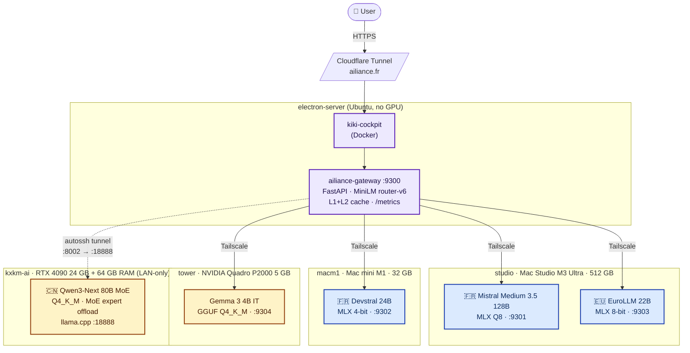
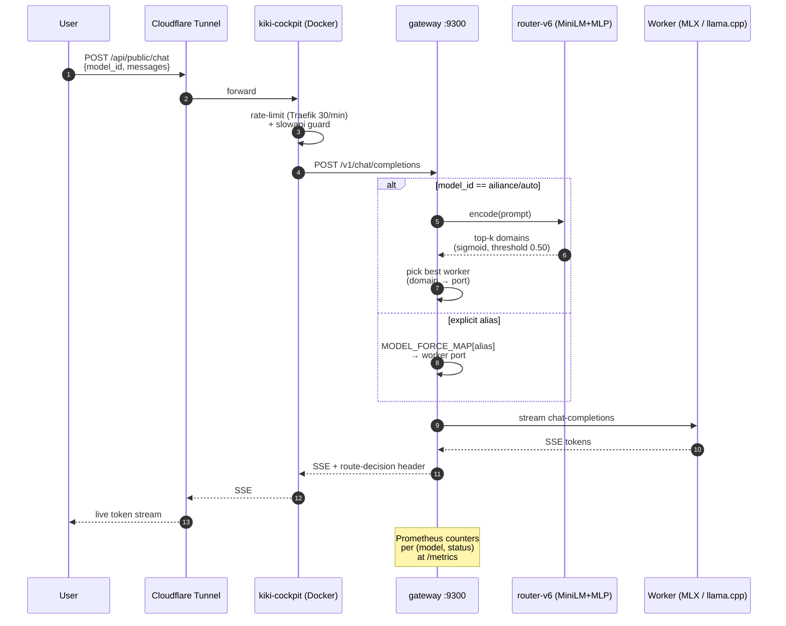
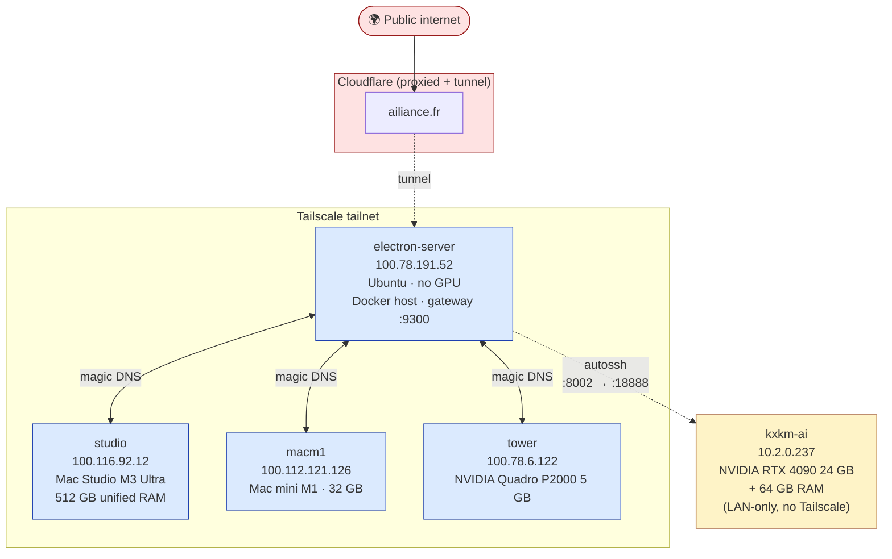
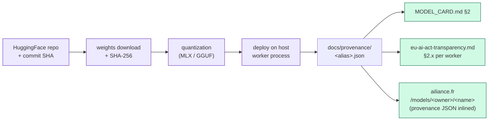
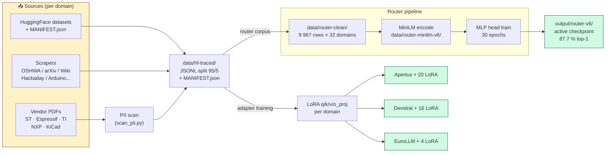

<div align="center">

# ailiance

### EU-sovereign LLM gateway — five production workers, full provenance, no cloud

[](https://ailiance.fr/api/public/status)
[](LICENSE)
[](docs/eu-ai-act-transparency.md)
[](docs/transparency/router-training-data.md)
[](https://ailiance.fr)

**Live now → [`ailiance.fr`](https://ailiance.fr)** · OpenAI-compatible API at [`/api/public/chat`](https://ailiance.fr/api/public/chat) · Health at [`/api/public/status`](https://ailiance.fr/api/public/status) · Transparency dossier at [`/transparency`](https://ailiance.fr/transparency)

</div>

---

## What it is

A **multi-model LLM serving pipeline** running on a home cluster — three EU/CH foundation models, two complementary base-model workers, all behind a single OpenAI-compatible endpoint. The router decides which model answers, the gateway forwards, the worker streams. No cloud, no telemetry, full audit trail.

### Architecture at a glance



Blue = EU/CH-origin · Amber = third-country base-model worker (annotated in transparency dossier).

### Request lifecycle



## Try it in 10 seconds

```bash
# Pick any worker — same OpenAI shape
curl -sN https://ailiance.fr/api/public/chat \
  -H 'Content-Type: application/json' \
  -d '{"model_id":"ailiance/qwen3-next-80b-a3b-instruct",
       "messages":[{"role":"user","content":"Compare LoRA and QLoRA in two sentences."}]}'

# Or let the router pick:
curl -sN https://ailiance.fr/api/public/chat \
  -H 'Content-Type: application/json' \
  -d '{"model_id":"ailiance/auto",
       "messages":[{"role":"user","content":"Show me a Rust function that parses TOML"}]}'
```

The route decision is surfaced in the SSE stream so you see *why* a worker was picked.

## Why ailiance exists

> Most "open" inference stacks are SaaS-shaped: black-box routing, undisclosed training data, telemetry by default, vendor lock-in dressed up as a free tier. ailiance is the opposite.

| | ailiance | Typical hosted API |
|---|---|---|
| **Where data goes** | Your LAN / Tailscale, period | Cloud egress to vendor |
| **Where weights came from** | HF commit SHA + SHA-256 per file | "Latest" rolling tag |
| **Why this model answered** | Surfaced in the SSE stream | Opaque |
| **Training data trail** | HF dataset id + SPDX license + row count per domain | "Public web" (or worse) |
| **Telemetry** | None | Default-on |
| **Risk classification** | EU AI Act Art. 52 (limited risk), documented | Usually unstated |
| **License of every served weight** | Apache‑2.0 / Gemma TOS, called out per worker | Mixed, usually unstated |

If you ship a product that needs to *prove* what model was used, on what data, under which license, ailiance gives you the receipts. If you're researching sovereign-AI patterns, the cluster + dossier are an honest reference.

## Production fleet

5/5 healthy on 2026-05-06 — verifiable live at [`/api/public/status`](https://ailiance.fr/api/public/status).

| Alias | Model | Origin | Quant | Host | Port |
|---|---|---|---|---|---|
| `ailiance-mistral` (alias `ailiance-apertus`) | **Mistral Medium 3.5 128B Instruct** | Mistral AI 🇫🇷 | MLX Q8 | studio (Mac Studio M3 Ultra, 512 GB) | `:9301` |
| `ailiance-devstral` | **Devstral Small 2 24B Instruct 2512** | Mistral AI 🇫🇷 | MLX 4-bit | macm1 (Mac mini M1, 32 GB) | `:9302` |
| `ailiance-eurollm` | **EuroLLM 22B Instruct 2512** | utter-project 🇪🇺 | MLX 8-bit | studio (Mac Studio M3 Ultra) | `:9303` |
| `ailiance-gemma` | **Gemma 3 4B IT** | Google DeepMind | GGUF Q4_K_M | tower (NVIDIA Quadro P2000 5 GB) | `:9304` |
| `ailiance-qwen` | **Qwen3-Next 80B A3B Instruct** | Qwen / Alibaba Cloud | Q4_K_M GGUF, MoE expert offload | kxkm-ai (NVIDIA RTX 4090 24 GB + 64 GB RAM) | `:8002` * |

\* Qwen reaches the gateway via an `autossh` tunnel (`electron-server:8002` → `kxkm-ai:18888`); kxkm-ai is LAN-only and is a **different machine** from `kx6tm-23` (Proxmox PVE host, no GPU). Other workers are addressed over Tailscale magic DNS.

#### Cluster topology



Note: kxkm-ai is a **distinct machine** from `kx6tm-23` (Proxmox PVE, AMD ES1000 only, no GPU) — earlier internal docs conflated them; the corrected mapping is reflected in [`docs/eu-ai-act-transparency.md` §2.7](docs/eu-ai-act-transparency.md).

LoRA adapters: Apertus (20 domains — electronics, EMC, DSP, SPICE, KiCad, STM32, IoT, embedded, MISRA-C, AUTOSAR, IEC norms…), Devstral (16 — Python, Rust, TypeScript, C++, shell, SQL, web, Docker, devops, llm-ops, ml-training…), EuroLLM (4 — chat-fr, traduction-tech, redaction-multilingue, localisation-doc). Gemma 3 and Qwen3-Next serve as base-model workers (no adapter).

## Routing — `router-v6`

| Property | Value |
|---|---|
| Encoder | `sentence-transformers/all-MiniLM-L6-v2` (384d, 22 M params) |
| Head | 384 → 256 → 32 MLP (sigmoid multi-label, threshold 0.50) |
| Domains | 32 |
| Top-1 / Top-3 (validation) | **87.7 %** / **98 %** |
| Δ vs router-v5 | +22 pts top-1, +13 pts top-3 |
| Encoder cache | L1 LRU 1024 (~0.01 ms hit) + L2 cosine ≥ 0.95 (~0.2 ms hit) + auto-prewarm at boot |
| Cold compute | ~9 ms on Studio MPS · ~17 ms on electron-server CPU |
| Training corpus | 9 967 rows across 32 domains (`data/router-clean/`), niche-augmented + greetings-grounded, AI-Act-traceable |

Confusion top-10 and per-domain stats: [`docs/transparency/confusion-top10.md`](docs/transparency/confusion-top10.md).

#### Classifier internals


⚠️ **Quarantined adapters** (verified 2026-05-05): EuroLLM `chat-fr` and `traduction-tech` produce `"user user user…"` loops from a chat-template leak. The worker silently falls back to the base EuroLLM for those domains — see `MLXWorkerRuntime.QUARANTINED_DOMAINS`. Re-train pending.

### Router v0.3 — Deliberation chain (preview)

Opt-in per-request via OpenAI `extra_body`. The gateway can wrap a
chat completion in a validator+retry loop driven by a domain-policy
map. Default behaviour is unchanged; clients that don't pass
`extra_body` keep the legacy 1-shot proxy path.

```jsonc
"extra_body": { "chain_policy": "deliberate", "include_audit": true }
```

See [`docs/router-v0.3-deliberate.md`](docs/router-v0.3-deliberate.md)
for the full API contract, audit-trail layout, and how to add a new
domain or wire the iact-bench validators submodule. Mixture (v0.3.1)
and Sequential (v0.4) are scaffolded but degrade to direct in v0.3.0.

## Provenance & EU AI Act compliance

Every served weight has a **provenance JSON** under [`docs/provenance/`](docs/provenance/), capturing per Annex IV §1(c):

- HuggingFace repo id + commit SHA + last-modified date
- Weights file name + SHA-256 + size
- Architecture summary (params, attention, context length)
- Quantization method
- Post-download modifications
- Intended use / out-of-scope use
- Deployment host + serving stack

The full transparency dossier — risk classification (Art. 52, limited risk), training-data documentation, evaluation summary (Art. 53(1)(d)), incident log, opt-out contact — is in [`docs/eu-ai-act-transparency.md`](docs/eu-ai-act-transparency.md).

The system card is [`MODEL_CARD.md`](MODEL_CARD.md) — performance numbers measured on this hardware, honest limitations.

#### Provenance trail (per served weight)



Each JSON in [`docs/provenance/`](docs/provenance/) is the single source of truth and gets inlined verbatim on the public model page so external auditors don't have to clone the repo.

## Headline benchmark results

| Bench | Subject | Result |
|---|---|---|
| HumanEval+ (Linux EvalPlus) | Devstral 24B 4-bit base | **87.20 / 82.90** |
| HumanEval+ | + python / cpp / rust adapters | −1.80 / −1.22 / −0.61 |
| MT-Bench full 80q (judge Mistral-Medium 128B) | Devstral base | **8.892 / 10** |
| GSM8K 5-shot, n=200 | Qwen 35B-A3B-4bit base | **94.5 %** |
| GSM8K | + reasoning / + math adapters | 0 / −4.5 |
| KIKI-DSL v3 (15 prompts, balanced) | Qwen base | 73.3 % pass / 0.704 avg |
| KIKI-DSL v3 | best adapter (`reasoning`) | **+13.4 pass pts** |
| KIKI-DSL v3 | worst adapter (`kicad-dsl`, narrow) | −27 pass pts |

Adapter wins on KIKI-DSL v3 do **not** transfer to GSM8K (saturated). Cross-bench analysis: [`MODEL_CARD.md`](MODEL_CARD.md) §4.5; known limitations §7.

## Quick start

```bash
# Setup
uv venv && uv pip install -e ".[dev,router,data]"

# Build training datasets (HF-traceable)
uv run python scripts/build_hf_datasets.py
uv run python scripts/scrape_oshwa.py
uv run python scripts/scrape_arxiv_eess.py
uv run python scripts/scrape_wikipedia_electronics.py

# Train LoRA adapters (3 models, sequential)
bash scripts/train_ailiance_batch.sh

# Train router-v6 (~25 min on macM1 MPS)
uv run python scripts/rebuild_router_dataset.py
uv run python scripts/build_router_data.py
uv run python scripts/encode_router_minilm.py
uv run python scripts/train_router_from_embeddings.py \
  --emb-dir data/router-minilm-v6 --hidden-dim 256 \
  --output-dir output/router-v6

# Launch
bash scripts/start.sh

# Test
uv run python -m pytest
```

## Source layout

```
src/
├── gateway/      FastAPI :9300, request dispatch, Prometheus /metrics
├── router/       MiniLM-L6-v2 + MLP head, L1+L2 cache, auto-prewarm
├── worker/       1 model / process, MLX or llama.cpp, BF16 / 4-bit
└── mlx_models/   Apertus MLX impl + custom xielu activation
```

## Configuration

| File | Role |
|------|------|
| `configs/apertus.yaml` | (legacy) Apertus 70B config — `:9301` on studio now serves Mistral Medium 3.5 128B Q8 via `scripts/deploy_mistral_studio.sh` (mlx<0.31 pinned for thread-stream regression). Alias `ailiance-apertus` retained for back-compat. |
| `configs/devstral.yaml` | Devstral 24B worker — port 9302, MLX 4-bit on macm1, 16 domains |
| `configs/eurollm.yaml` | EuroLLM 22B worker — port 9303, MLX 8-bit on studio, 4 domains |
| `configs/gateway.yaml` | FastAPI gateway + router config (Gemma 3 on tower :9304, Qwen3-Next on kxkm-ai :8002 via autossh) |

## Data pipeline

| Source | Script | Items |
|---|---|---|
| OSHWA-certified projects | `scrape_oshwa.py` | 3 265 |
| arXiv EESS papers | `scrape_arxiv_eess.py` | — |
| Wikipedia electronics | `scrape_wikipedia_electronics.py` | — |
| Hackaday writeups | `scrape_hackaday.py` | — |
| Arduino / ESP-IDF / STM32 / Rust embedded examples | `scrape_*_examples.py` | — |
| KiCad schematics | `scrape_kicad_schematics.py` | — |
| HuggingFace datasets | `build_hf_datasets.py` | 48 K (20 domains) |
| Vendor PDFs (ST/Espressif/TI/NXP/KiCad) | `scripts/pdf_pipeline/` | 360 pairs |

`data/hf-traced/` (404 MB) — 35 domain folders, JSONL, split 95/5, max 3 000/domain, seed 42. Each `MANIFEST.json` carries `hf_dataset_id`, `license`, `download_date`, `n_source_rows`, `n_used`. PDF pipeline obeys robots.txt under EU DSM Art. 4 TDM exception, SHA-256 manifests — audit at [`docs/pdf-compliance-report.md`](docs/pdf-compliance-report.md).

#### Data → adapter → router



## Compliance docs

| Document | What's inside |
|---|---|
| [`MODEL_CARD.md`](MODEL_CARD.md) | System card — measured performance, limitations, intended/out-of-scope use, Art. 53(1)(d) eval summary |
| [`docs/eu-ai-act-transparency.md`](docs/eu-ai-act-transparency.md) | Master transparency dossier, Art. 52 / 53, full provenance chain, change log |
| [`docs/provenance/`](docs/provenance/) | Per-model JSON (Annex IV §1(c)) — one file per served alias |
| [`docs/transparency/router-training-data.md`](docs/transparency/router-training-data.md) | Router corpus provenance, license per domain |
| [`docs/transparency/confusion-top10.md`](docs/transparency/confusion-top10.md) | Top-10 router confusions, per-domain accuracy |
| [`docs/pdf-compliance-report.md`](docs/pdf-compliance-report.md) | Vendor-PDF pipeline audit (robots.txt, DSM Art. 4 TDM) |
| [`docs/vlm-compliance-report.md`](docs/vlm-compliance-report.md) | VLM POC audit |
| [`eval/WORKFLOW.md`](eval/WORKFLOW.md) | Bench pipeline trace (3-host topology, bug history, full results) |
| [`eval/results/SUMMARY.md`](eval/results/SUMMARY.md) | Aggregated benchmark table |

## Key design decisions

- **Mixed-precision per host** — MLX 8-bit on the M3 Ultra (free RAM), MLX 4-bit on the M1 mini (constrained), Q4_K_M GGUF + MoE offload on the RTX 4090 (sweet spot for 80B MoE on 24 GB VRAM).
- **One model per process** — isolation, predictable memory, clean shutdown.
- **Sigmoid routing, not softmax** — domains overlap (`docker` ∩ `devops`, `embedded` ∩ `stm32`); multi-label is honest.
- **LoRA on `q/k/v/o_proj` only** — minimal footprint, full provenance, fast hot-swap.
- **Backend portability** — the OpenAI-compatible HTTP contract runs on Apple Silicon (MLX), CUDA (vLLM, TGI, llama.cpp), ROCm, and CPU (llama.cpp). MLX is reference, not requirement.
- **HF-traceable everything** — every weight, every adapter, every training row has a `MANIFEST.json` with provenance.

## Sister project

[`KIKI-Mac_tunner`](https://github.com/L-electron-Rare/KIKI-Mac_tunner) — non-EU foundation distillation track (Mistral Large, Qwen3.5-122B, Devstral 2 123B dense). The ailiance training scripts (`train_ailiance_*.py`) and configs are mirrored there.

## License

Apache-2.0 for the codebase and all ailiance adapters. Per-worker licenses called out per row in [Production fleet](#production-fleet) — Gemma 3 carries Google's Gemma Terms of Use, review obligations apply for downstream commercial use.

---

<div align="center">
<sub>Built in France 🇫🇷 · No cloud · Apache-2.0 · <a href="https://ailiance.fr">ailiance.fr</a></sub>
</div>
